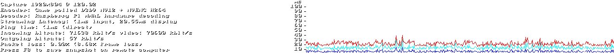
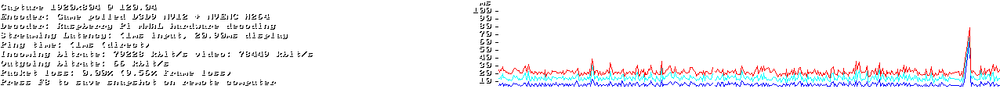
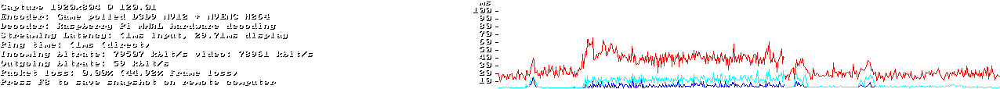

This repository will be documenting my adventure to setting up [Steam Link](https://store.steampowered.com/app/353380/Steam_Link/) on my [Raspberry Pi 4 Model B](https://www.amazon.com/Raspberry-Model-2019-Quad-Bluetooth/dp/B07TC2BK1X) devices.

My goal is to stream games from my desktop (*Host A* below) to my projector at **1920x1080**@**120Hz** (FPS). I'm *currently* running into issues which is why I'll be listing everything here and posting online for help if I can't find a solution.

## My Setup
My general setup may be found [here](https://github.com/gamemann/Home-Lab).

During stream testing, I played the game **Left 4 Dead 2** on Dead Center (testing in the safe room area). The issues I've faced so far happen across multiple games as well including Halo Master Chief Collection (MCC) and Call of Duty 4: Modern Warfare campaign (Original).

### Host A Setup (Desktop)
* Windows 11 (22H2)
* RTX 3090 TI
* AMD Ryzen 9 5900X (12c/24t)
* 64 GBs DDR4 RAM
* 2 x 2 TBs NVMe (Samsung 970 EVO and Samsung 980 PRO)
* 1 gbps on-board NIC (wired)

### Host B Setup (Laptop)
* Linux (Ubuntu 23.04 with kernel `6.2.0-20-generic`)
* GTX 1660 TI
* AMD Ryzen 7 4800H (8c/16t)
* 16 GBs DDR4 RAM
* 1 TB NVMe
* 5GHz WiFi (not used with Steam Link)
* 1 gbps on-board NIC (used with Steam Link)

**This device is only used for testing to make sure there aren't any issues with Host A. There has been no difference between Host A and Host B when testing and issues have remained the same.**

### Steam Link Device #1
* Raspberry Pi 4 Model B
* Runs Raspberry OS Buster (10) LITE (no desktop GUI) with kernel `5.10.103-v7l+`
* 16 GBs MicroSD card
* Allocated 128/256 MBs of GPU memory via `sudo raspi-config` -> Performance -> GPU Memory
* Wired Ethernet for Steam Link (1 gbps)

### Installing Steam Link
Installing Steam Link on Raspberry OS Buster (10) was the easiest for me. All I ran was the following after setting up the main OS.

```bash
# Upgrade packages.
sudo apt update && sudo apt upgrade -y

# Reboot
sudo reboot

# Install Steam Link
sudo apt install -y steamlink
```

### Steam Link Settings


### Performance Graphs With Keyboard/Mouse



### More Information
Here's the outputs of additional commands giving more information on this device.

```bash
# Kernel
pi@sl01:~ $ uname -r
5.10.103-v7l+

pi@sl01:~ $ uname -a
Linux raspberrypi 5.10.103-v7l+ #1529 SMP Tue Mar 8 12:24:00 GMT 2022 armv7l GNU/Linux

# Release
pi@sl01:~ $ cat /etc/*-release
PRETTY_NAME="Raspbian GNU/Linux 10 (buster)"
NAME="Raspbian GNU/Linux"
VERSION_ID="10"
VERSION="10 (buster)"
VERSION_CODENAME=buster
ID=raspbian
ID_LIKE=debian
HOME_URL="http://www.raspbian.org/"
SUPPORT_URL="http://www.raspbian.org/RaspbianForums"
BUG_REPORT_URL="http://www.raspbian.org/RaspbianBugs"

# Processor information
pi@sl01:~ $ cat /proc/cpuinfo
processor       : 0
model name      : ARMv7 Processor rev 3 (v7l)
BogoMIPS        : 108.00
Features        : half thumb fastmult vfp edsp neon vfpv3 tls vfpv4 idiva idivt vfpd32 lpae evtstrm crc32
CPU implementer : 0x41
CPU architecture: 7
CPU variant     : 0x0
CPU part        : 0xd08
CPU revision    : 3

processor       : 1
model name      : ARMv7 Processor rev 3 (v7l)
BogoMIPS        : 108.00
Features        : half thumb fastmult vfp edsp neon vfpv3 tls vfpv4 idiva idivt vfpd32 lpae evtstrm crc32
CPU implementer : 0x41
CPU architecture: 7
CPU variant     : 0x0
CPU part        : 0xd08
CPU revision    : 3

processor       : 2
model name      : ARMv7 Processor rev 3 (v7l)
BogoMIPS        : 108.00
Features        : half thumb fastmult vfp edsp neon vfpv3 tls vfpv4 idiva idivt vfpd32 lpae evtstrm crc32
CPU implementer : 0x41
CPU architecture: 7
CPU variant     : 0x0
CPU part        : 0xd08
CPU revision    : 3

processor       : 3
model name      : ARMv7 Processor rev 3 (v7l)
BogoMIPS        : 108.00
Features        : half thumb fastmult vfp edsp neon vfpv3 tls vfpv4 idiva idivt vfpd32 lpae evtstrm crc32
CPU implementer : 0x41
CPU architecture: 7
CPU variant     : 0x0
CPU part        : 0xd08
CPU revision    : 3

Hardware        : BCM2711
Revision        : c03114
Serial          : 10000000d778dec3
Model           : Raspberry Pi 4 Model B Rev 1.4

# Memory information
pi@sl01:~ $ cat /proc/meminfo
MemTotal:        3878088 kB
MemFree:         3544812 kB
MemAvailable:    3622200 kB
Buffers:           17888 kB
Cached:           188680 kB
SwapCached:            0 kB
Active:           121772 kB
Inactive:         122768 kB
Active(anon):        532 kB
Inactive(anon):    55140 kB
Active(file):     121240 kB
Inactive(file):    67628 kB
Unevictable:        8956 kB
Mlocked:              16 kB
HighTotal:       3211264 kB
HighFree:        2964808 kB
LowTotal:         666824 kB
LowFree:          580004 kB
SwapTotal:        102396 kB
SwapFree:         102396 kB
Dirty:                 0 kB
Writeback:             0 kB
AnonPages:         46964 kB
Mapped:            81176 kB
Shmem:             17700 kB
KReclaimable:      12884 kB
Slab:              28024 kB
SReclaimable:      12884 kB
SUnreclaim:        15140 kB
KernelStack:        1176 kB
PageTables:         1892 kB
NFS_Unstable:          0 kB
Bounce:                0 kB
WritebackTmp:          0 kB
CommitLimit:     2041440 kB
Committed_AS:     253260 kB
VmallocTotal:     245760 kB
VmallocUsed:        5240 kB
VmallocChunk:          0 kB
Percpu:              528 kB
CmaTotal:         327680 kB
CmaFree:          287400 kB

# Partitions information
pi@sl01:~ $ cat /proc/partitions
major minor  #blocks  name

   1        0       4096 ram0
   1        1       4096 ram1
   1        2       4096 ram2
   1        3       4096 ram3
   1        4       4096 ram4
   1        5       4096 ram5
   1        6       4096 ram6
   1        7       4096 ram7
   1        8       4096 ram8
   1        9       4096 ram9
   1       10       4096 ram10
   1       11       4096 ram11
   1       12       4096 ram12
   1       13       4096 ram13
   1       14       4096 ram14
   1       15       4096 ram15
 179        0   15267840 mmcblk0
 179        1     262144 mmcblk0p1
 179        2   15001600 mmcblk0p2

# More version information
pi@sl01:~ $ cat /proc/version
Linux version 5.10.103-v7l+ (dom@buildbot) (arm-linux-gnueabihf-gcc-8 (Ubuntu/Linaro 8.4.0-3ubuntu1) 8.4.0, GNU ld (GNU Binutils for Ubuntu) 2.34) #1529 SMP Tue Mar 8 12:24:00 GMT 2022

# USB devices
pi@sl01:~ $ lsusb
Bus 002 Device 001: ID 1d6b:0003 Linux Foundation 3.0 root hub
Bus 001 Device 005: ID 1532:0226 Razer USA, Ltd
Bus 001 Device 004: ID 093a:2533 Pixart Imaging, Inc.
Bus 001 Device 003: ID 2109:2817 VIA Labs, Inc.
Bus 001 Device 002: ID 2109:3431 VIA Labs, Inc. Hub
Bus 001 Device 001: ID 1d6b:0002 Linux Foundation 2.0 root hub

# PCI devices
pi@sl01:~ $ lspci
00:00.0 PCI bridge: Broadcom Limited Device 2711 (rev 20)
01:00.0 USB controller: VIA Technologies, Inc. VL805 USB 3.0 Host Controller (rev 01)
```

### Steam Link Device #2
* Raspberry Pi 4 Model B
* Runs Raspberry OS Bullseye (11) LITE (no desktop GUI) with kernel `6.1.61-v8+`
* 128 GBs MicroSD card
* Allocated 128/256 MBs of GPU memory via `sudo raspi-config` -> Performance -> GPU Memory
* Wired Ethernet for Steam Link (1 gbps)

### Installing Steam Link
Installing Steam Link on Raspberry OS Bullseye (11) was a little more complicated. I used [this](https://raw.githubusercontent.com/icolwell/install_scripts/master/steamlink_install.bash) install script.

```bash
# Upgrade packages.
sudo apt update && sudo apt upgrade -y

# Reboot
sudo reboot

# Retrieve install script by Icolwell
wget https://raw.githubusercontent.com/icolwell/install_scripts/master/steamlink_install.bash

# Run the script to install Steam Link
./steamlink_install.bash
```

### Steam Link Settings


### Performance Graphs With Keyboard/Mouse



### More Information
Here's the outputs of additional commands giving more information on this device.

```bash
# Kernel
pi@sl02:~ $ uname -r
6.1.61-v8+

pi@sl02:~ $ uname -a
Linux stress 6.1.61-v8+ #1696 SMP PREEMPT Thu Nov  2 16:44:46 GMT 2023 aarch64 GNU/Linux

# Release
pi@sl02:~ $ cat /etc/*-release
PRETTY_NAME="Debian GNU/Linux 11 (bullseye)"
NAME="Debian GNU/Linux"
VERSION_ID="11"
VERSION="11 (bullseye)"
VERSION_CODENAME=bullseye
ID=debian
HOME_URL="https://www.debian.org/"
SUPPORT_URL="https://www.debian.org/support"
BUG_REPORT_URL="https://bugs.debian.org/"

# Processor information
pi@sl02:~ $ cat /proc/cpuinfo
processor       : 0
BogoMIPS        : 108.00
Features        : fp asimd evtstrm crc32 cpuid
CPU implementer : 0x41
CPU architecture: 8
CPU variant     : 0x0
CPU part        : 0xd08
CPU revision    : 3

processor       : 1
BogoMIPS        : 108.00
Features        : fp asimd evtstrm crc32 cpuid
CPU implementer : 0x41
CPU architecture: 8
CPU variant     : 0x0
CPU part        : 0xd08
CPU revision    : 3

processor       : 2
BogoMIPS        : 108.00
Features        : fp asimd evtstrm crc32 cpuid
CPU implementer : 0x41
CPU architecture: 8
CPU variant     : 0x0
CPU part        : 0xd08
CPU revision    : 3

processor       : 3
BogoMIPS        : 108.00
Features        : fp asimd evtstrm crc32 cpuid
CPU implementer : 0x41
CPU architecture: 8
CPU variant     : 0x0
CPU part        : 0xd08
CPU revision    : 3

Revision        : c03115
Serial          : 10000000b02fe8cf
Model           : Raspberry Pi 4 Model B Rev 1.5

# Memory information
pi@sl02:~ $ cat /proc/meminfo
MemTotal:        3833280 kB
MemFree:         3394660 kB
MemAvailable:    3602380 kB
Buffers:           27732 kB
Cached:           236844 kB
SwapCached:            0 kB
Active:           265588 kB
Inactive:          47060 kB
Active(anon):      57820 kB
Inactive(anon):     1308 kB
Active(file):     207768 kB
Inactive(file):    45752 kB
Unevictable:        9852 kB
Mlocked:              16 kB
SwapTotal:        102396 kB
SwapFree:         102396 kB
Zswap:                 0 kB
Zswapped:              0 kB
Dirty:                 0 kB
Writeback:             0 kB
AnonPages:         57960 kB
Mapped:            99944 kB
Shmem:             11052 kB
KReclaimable:      21908 kB
Slab:              45440 kB
SReclaimable:      21908 kB
SUnreclaim:        23532 kB
KernelStack:        2736 kB
PageTables:         2152 kB
SecPageTables:         0 kB
NFS_Unstable:          0 kB
Bounce:                0 kB
WritebackTmp:          0 kB
CommitLimit:     2019036 kB
Committed_AS:     365952 kB
VmallocTotal:   259653632 kB
VmallocUsed:       10124 kB
VmallocChunk:          0 kB
Percpu:              656 kB
CmaTotal:         524288 kB
CmaFree:          484900 kB

# Partitions information
pi@sl02:~ $  cat /proc/partitions
major minor  #blocks  name

   1        0       4096 ram0
   1        1       4096 ram1
   1        2       4096 ram2
   1        3       4096 ram3
   1        4       4096 ram4
   1        5       4096 ram5
   1        6       4096 ram6
   1        7       4096 ram7
   1        8       4096 ram8
   1        9       4096 ram9
   1       10       4096 ram10
   1       11       4096 ram11
   1       12       4096 ram12
   1       13       4096 ram13
   1       14       4096 ram14
   1       15       4096 ram15
 179        0  124835328 mmcblk0
 179        1     262144 mmcblk0p1
 179        2  124569088 mmcblk0p2

# More version information
pi@sl02:~ $ cat /proc/version
Linux version 6.1.61-v8+ (dom@buildbot) (aarch64-linux-gnu-gcc-8 (Ubuntu/Linaro 8.4.0-3ubuntu1) 8.4.0, GNU ld (GNU Binutils for Ubuntu) 2.34) #1696 SMP PREEMPT Thu Nov  2 16:44:46 GMT 2023
```

### Projector
[BenQ TH685P](https://www.amazon.com/dp/B09V22YRMJ) running at 1920x1080p@120Hz (FPS).

### Controllers
* [Xbox Core Wireless Controller - Carbon Black](https://www.amazon.com/gp/product/B08DF248LD) via BlueTooth (primarily) or USB (for testing).
* [Forty4 Wireless Gaming Controller](https://www.amazon.com/gp/product/B0894RCSV4) via USB dongle. Recognized as Xbox 360 Controller.

#### Xpadneo
I've installed [xpadneo](https://github.com/atar-axis/xpadneo) on all Steam Link devices for controller support with Xbox 360 and Xbox Series S.

```bash
# Install Raspberry Pi kernel headers + DKMS
sudo apt install -y dkms raspberrypi-kernel-headers

# Clone xpadneo
git clone https://github.com/atar-axis/xpadneo.git

# Change directory
cd xpadneo

# Install
sudo ./install.sh

# Reboot
sudo reboot
```

I've had a lot of issues with pairing my Xbox Core Wireless Controller through BlueTooth in the past. However, I found this time around that stock installs of Buster (10) and Bullseye (11) with the `xpadneo` driver works *without* any other steps such as disabling ERTM or SAP. To pair my controllers through BlueTooth, I normally execute the following commands.

```bash
sudo bluetoothctl

# Will go into BlueTooth CLI...

# Set default agent (probably not needed, but I like doing it just in case)
default-agent

# Start scanning for devices
scan on

# Start pairing Xbox controller and find/copy MAC address of controller...

# Pair/connect to controller
connect <mac address>

# Wait until it connects, it should vibrate and have a steady light...

# Trust controller so I don't have to repair
trust <mac address>

# To remove, unpair, and untrust device, just execute the following
remove <mac address>

# To leave, use exit command
exit
```

### Systemd Service
I use a simple `systemd` service to automatically start Steam Link on boot and also to reopen it if closed (I would accidently close Steam Link with my controller at times which became annoying since I'd need to manually start Steam Link again).

Create a `steamlink.service` file in the `systemd` service's directory via `nano /etc/systemd/system/steamlink.service` and paste the following.

```bash
[Unit]
Description=Steam Link

[Service]
Type=simple
User=pi
ExecStart=/usr/bin/steamlink
Restart=always

[Install]
WantedBy=multi-user.target
```

Afterwards, I enable the service and reboot with the following commands.

```bash
# Enable service on boot (systemctl daemon-reload shouldn't be needed if it's a new file)
sudo systemctl enable steamlink

# Reboot
sudo reboot
```

**Note A** - If you have a different user other than `pi`, make sure to change the `User=pi` line to whatever user you want Steam Link starting with (e.g. `User=christian`).

**Note B** - I would also recommend having OpenSSH enabled on the Steam Link device if `Restart=always` is present in the `systemd` file since it will keep restarting Steam Link after exiting through the main TTY (until it reaches fail count). You can enable the OpenSSH service by executing `sudo raspi-config` and then navigating to Interfaces -> SSH (on Buster and Bullseye).

### Monitor For Testing
When not using the projector (e.g. I'm at my desk), I use an [Acer KC242Y](https://www.amazon.com/dp/B0BS9T3FNB) monitor (100 Hz) with [this](https://www.amazon.com/dp/B0C6GF5S14) KVM switch for testing the Steam Link devices. I highly doubt the monitor is the cause to the issues I'm facing, especially since it also occurs on the projector as well, but just wanted to note it down.

## Current Status
### Steam Link Device #1
Running Steam Link on this device has the lowest latency and lowest frame loss percentage. It seems Buster (10) is the most stable OS for Steam Link with the Raspberry Pi with the testing I've concluded so far.

Unfortunately, issue #1 (below) impacts this device regardless of public/beta Steam Link builds. However, using a keyboard/mouse results in mostly smooth gameplay.

**Display Latency** - Around 20 - 30ms  
**Frame Loss Percentage** - Up to 7 - 8% (no packet loss)

### Steam Link Device #2
Running Steam Link on this device has the highest latency and highest frame loss percentage. While it is still somewhat playable with a keyboard/mouse, I would definitely prefer running Raspberry OS Buster (10) since that is the most stable.

Unfortunately, issue #1 (below) also impacts this device regardless of public/beta Steam Link builds. Using the keyboard/mouse doesn't have issues, but the latency/frame loss is still noticeably higher compared to device #1.

**Display Latency** - 30 - 50ms (with spikes up to 60ms)  
**Frame Loss Percentage** - Up to 40% (no packet loss)

## Issues
### [Controllers Causing High Display Latency + Frame Loss (#1)](https://github.com/gamemann/Steam-Link-Setup-And-Issues-On-Raspberry-Pi/issues/1)
